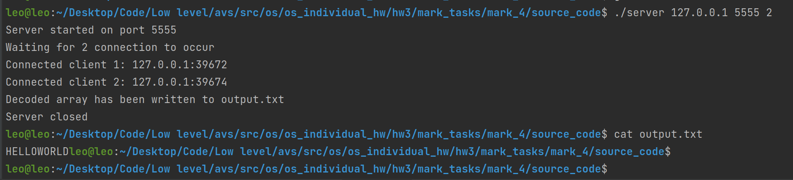
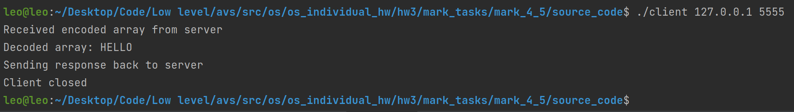
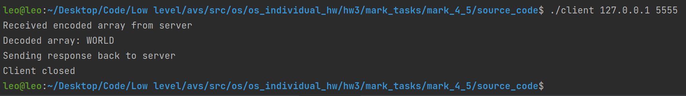

# ИДЗ №2, программа на оценку 4 и 5

### Критерии
**Выполнены все критерии для получения оценки 5:**
1) Используются TCP сокеты для пересылки данных
2) Для задания количества процессов используется аргумент командной строки PROC_COUNT `./server <IP> <PORT> <PROC_COUNT>`
3) Тестовые наборы предоставлены в этой [папке](tests) в виде файлов `input.txt`, там же и лежат корректные ответы в виде файлов `output.txt`

### Схема работы
Запускается сервер на указанном `IP`, `PORT` и с указанным количеством клиентов `PROC_COUNT`. Сервер считывает закодированную последовательность из input.txt и ждет подключения `PROC_COUNT` клиентов. После их подключения, идет равномерное распределение закодированного массива между ними. После этого, с помощью fork() идет параллельная отправка закодированных отрывков и последующий прием декодированных фрагментов от клиентов. Затем происходит вывод всего результата декодирования в output.txt
Если размер массива для декодирования меньше количества процессов, то вся работа выполнится последовательно последним дочерним процессом.

### Как пользоваться
Если вы желаете скомпилировать бинарный файл самостоятельно, то следует прописать следующие команды в терминале, находясь в папке [source_code](source_code):
1) `gcc main.c -o main`

Запустите бинарный файл `main` в папке `binaries` с аргументами командной строки. Учтите, что файл ввода должен существовать, иначе вы получите ошибку.\
Пример: `./main proc_count`. `proc_count` - количество дочерних процессов (от 1 до 32).

Ввод осуществляется из файла `input.txt`, убедитесь что он существует в той же папке, что бинарный файл. Вывод ответа осуществляется в файл `output.txt`.

#### Формат ввода
`size arg_1 .. arg_k`, где `size` количество символов для декодирования, `arg_i` - i-ый символ для декодирования. `arg_i` должно быть целым числом и берется по модулю 26. `size` должно быть больше 0. 

### Пример работы

