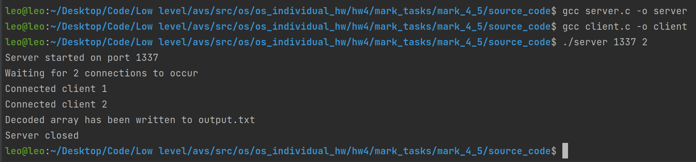
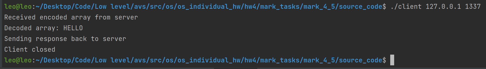

# ИДЗ №2, программа на оценку 4 и 5

### Критерии
**Выполнены все критерии для получения оценки 5:**
1) Используются UDP сокеты для пересылки данных
2) Для задания количества процессов используется аргумент командной строки PROC_COUNT `./server <PORT> <PROC_COUNT>`
3) Тестовые наборы предоставлены в этой [папке](tests) в виде файлов `input.txt`, там же и лежат корректные ответы в виде файлов `output.txt`

### Схема работы
1) Запускается сервер на указанном `PORT` и с указанным количеством клиентов `PROC_COUNT`. 
2) Сервер считывает закодированную последовательность из input.txt и ждет подключения `PROC_COUNT` клиентов на адрес сервера по указанному порту. 
3) После их подключения, идет равномерное распределение закодированного массива между ними. 
4) После этого, с помощью `fork()` идет параллельная отправка закодированных отрывков и последующий прием декодированных фрагментов от клиентов. 
5) Последний шаг - вывод всего результата декодирования в output.txt.

Если размер массива для декодирования меньше количества процессов (клиентов), то вся работа выполнится последовательно последним дочерним процессом (подключенным клиентом).

### Как пользоваться
Если вы желаете скомпилировать бинарные файлы самостоятельно, то следует прописать следующие команды в терминале, находясь в папке [source_code](source_code):
1) `gcc server.c -o server`
2) `gcc client.c -o client`

- Запустите бинарный файл `server` в папке `binaries` с аргументами командной строки. Учтите, что файл ввода должен существовать, иначе вы получите ошибку.\
Пример: `./server 5555 proc_count`. `proc_count` - количество дочерних процессов (от 1 до 32).
- Затем требуется запустить `proc_count` клиентов, указав тот же адрес и порт, что вы использовали для сервера.
В случае локальной работы это будет: `./client 127.0.0.1 5555`.
- После того, как ровно `proc_count` подключатся к серверу, будет выполнена пересылка данных и запись ответа.

Ввод осуществляется из файла `input.txt`, убедитесь что он существует в той же папке, что бинарный файл сервера. Вывод ответа осуществляется в файл `output.txt`.

#### Формат ввода
`size arg_1 .. arg_k`, где `size` количество символов для декодирования, `arg_i` - i-ый символ для декодирования. `arg_i` должно быть целым числом и берется по модулю 26. `size` должно быть больше 0. 

### Примечание
Обратите внимание, что максимальный размер клиентского буфера 1024 байта, а клиента монитора 2048.

### Пример работы

