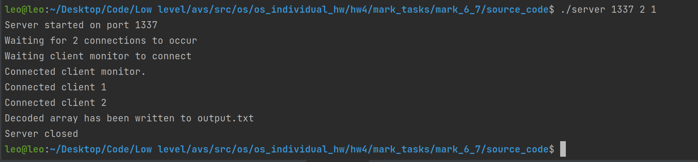
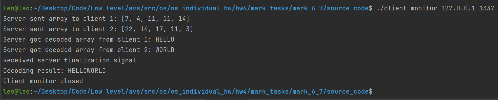
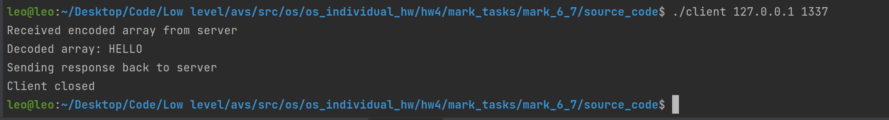
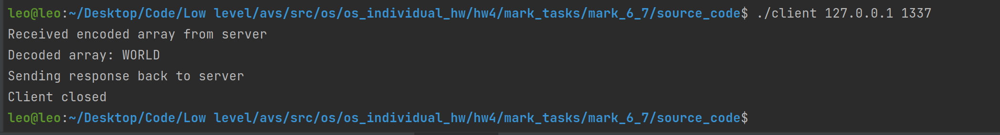

# ИДЗ №2, программа на оценку 6 и 7

### Критерии
**Выполнены все критерии для получения оценки 7:**
1) Используются UDP сокеты для пересылки данных
2) Для задания количества процессов используется аргумент командной строки PROC_COUNT `./server <PORT> <PROC_COUNT>`
3) Возможно использование специального клиента монитора, который выводит всю информацию о коммуникации сервера и множества клиентов. Потребовать его использование можно 4ым аргументом командной строки. Например: `./server 5555 2 monitor`
3) Тестовые наборы предоставлены в этой [папке](tests) в виде файлов `input.txt`, там же и лежат корректные ответы в виде файлов `output.txt`

### Схема работы
1) Запускается сервер на указанном `PORT` и с указанным количеством клиентов `PROC_COUNT`. 
2) Сервер считывает закодированную последовательность из input.txt и ждет подключения клиента монитора (если был указан 4ый аргумент командной строки) и затем `PROC_COUNT` клиентов декодировщиков на адрес сервера по указанному порту. 
3) После их подключения, идет равномерное распределение закодированного массива между ними. 
4) После этого, с помощью `fork()` идет параллельная отправка закодированных отрывков и последующий прием декодированных фрагментов от клиентов.
5) Если используется клиент монитор, то промежуточные шаги отправляются ему для отображения.
6) Последний шаг - вывод всего результата декодирования в output.txt. Если используется клиент монитор, то конечнй результат также будет отправлен ему (см. пример работы).

Если размер массива для декодирования меньше количества процессов (клиентов), то вся работа выполнится последовательно последним дочерним процессом (подключенным клиентом).

### Как пользоваться
Если вы желаете скомпилировать бинарные файлы самостоятельно, то следует прописать следующие команды в терминале, находясь в папке [source_code](source_code):
1) `gcc server.c -o server`
2) `gcc client.c -o client`
3) `gcc client_monitor.c -o client_monitor`

- Запустите бинарный файл `server` в папке `binaries` с аргументами командной строки. Учтите, что файл ввода должен существовать, иначе вы получите ошибку.\
Пример: `./server 5555 proc_count monitor`. `proc_count` - количество дочерних процессов (от 1 до 32).
- Если был указан параметр, отвечающий за подключение клиента монитора, то сначала требуется запустить клиент монитор. Он запускается также, как обычные клиенты, но с использованием бинарного файла `client_monitor`.
- Затем требуется запустить `proc_count` клиентов, указав тот же адрес и порт, что вы использовали для сервера.
В случае локальной работы это будет: `./client 127.0.0.1 5555`.
- После того, как ровно `proc_count` подключатся к серверу, будет выполнена пересылка данных и запись ответа.
- Все промежуточные шаги и конечный результат будут направлены клиенту монитору, если таковой был использован.

Ввод осуществляется из файла `input.txt`, убедитесь что он существует в той же папке, что бинарный файл сервера. Вывод ответа осуществляется в файл `output.txt`.

#### Формат ввода
`size arg_1 .. arg_k`, где `size` количество символов для декодирования, `arg_i` - i-ый символ для декодирования. `arg_i` должно быть целым числом и берется по модулю 26. `size` должно быть больше 0. 

### Пример работы

