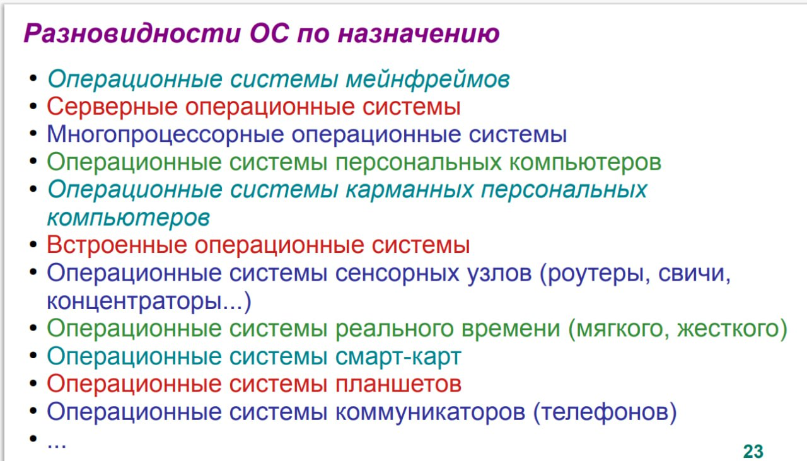

### Задание №1 по ОС

1) Операционные системы мейнфреймов
    * 05/390
    * Arch Linux
    * Fedora (Linux)
2) Серверные ОС
    * Windows Server
    * FreeBSD (Linux)
    * Debian (Linux)
3) Многопроцессорные ОС
    * Windows 7+
    * Ubuntu
    * Debian
4) Операционные системы ПК
    * Windows
    * Any linux Distro
    * Mac OS
5) Операционные системы карманных ПК
    * Windows Phone
    * Symbian OS
    * Palm OS
6) Встроенные операционные системы
    * Windows CE
    * Windows Embedded 
    * Windows Embedded for Point of Service
7) Операционные системы сенсорных узлов
    * TinyOS
8) Операционные системы реального времени
    * FreeRTOS
    * KeilRTX
    * RTLinux
9) Операционные системы cмарт-карт
    * GemXplore
    * CardOS
    * AuthenIC
10) Операционные системы планшетов
    * iPad OS
    * Android
11) Операционные системы коммуникаторов (телефонов)
    * iOS
    * Android
    * Windows Phone (dead)
    