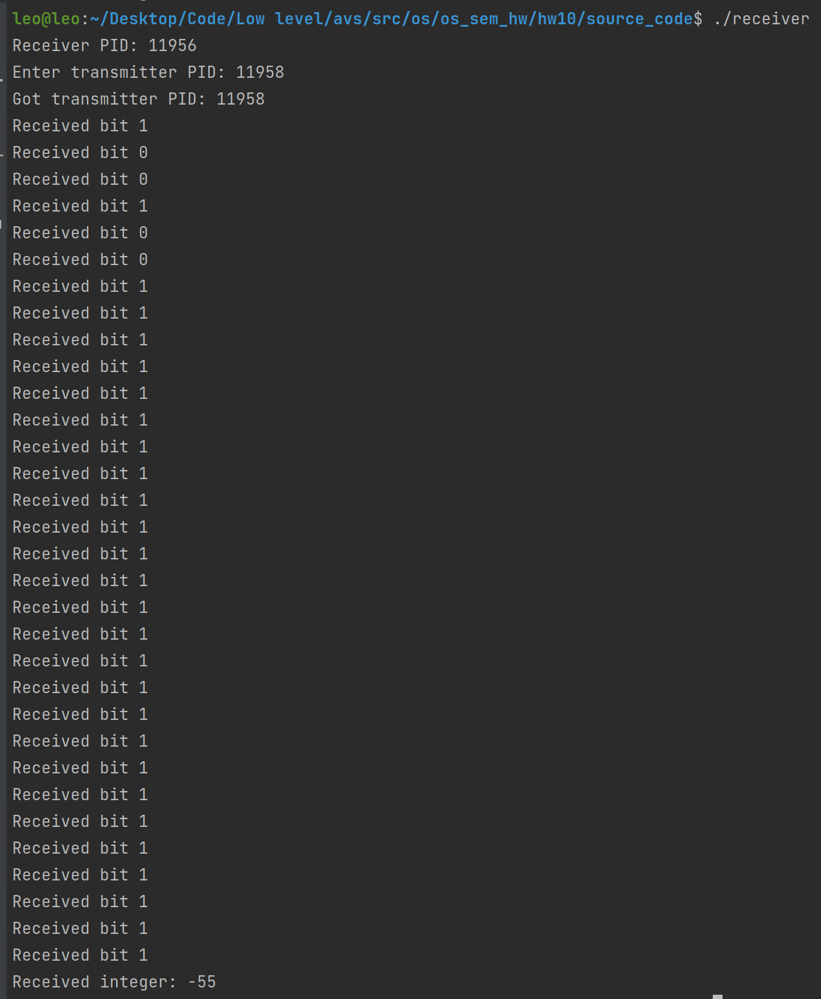
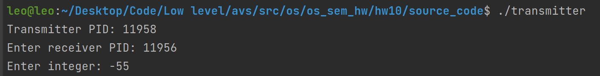

# Семинарское домашнее задание №10

### Взаимодействие двух независимых процессов через сигналы
#### О задании
* В исходном файле [receiver.с](source_code/receiver.c) происходит получение числа по битам и отправка подтверждения о получении очередного бита.
* В исходном файле [transmitter.c](source_code/transmitter.c) происходит передача числа по битам и получение подтверждения о получении другим процессом очередного бита.

#### Запуск
Для запуска требуется скомпилировать исходные файлы [receiver.c](source_code/receiver.c) и [transmitter.c](source_code/transmitter.c) в папке [source_code](source_code) следующими командами:
1) `gcc receiver.c -o receiver`
2) `gcc transmitter.c -o transmitter`

Запуск затем можно произвести командой:
1) `./receiver`
2) `./transmitter`

#### Пример работы

