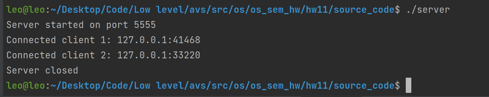
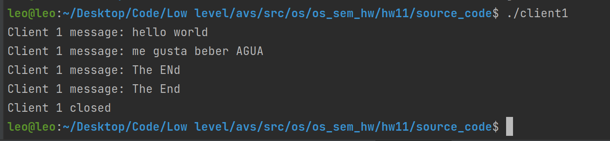

# Семинарское домашнее задание №11

### Взаимодействие TCP клиентов через сервер
#### О задании
* В исходном файле [server.с](source_code/server.c) происходит получение сообщения от клиента 1 и его пересылка клиенту 2. Если получено сообщение 'The End', то происходит завершение работы.
* В исходном файле [client1.с](source_code/client1.c) происходит ввод сообщения и его пересылка на сервер. Если получено сообщение 'The End', то происходит завершение работы.
* В исходном файле [client2.с](source_code/client2.c) происходит получение сообщения от сервера. Если получено сообщение 'The End', то происходит завершение работы.

#### Запуск
Для запуска требуется скомпилировать исходные файлы [server.c](source_code/server.c), [client1.c](source_code/client1.c) и [client2.c](source_code/client2.c) в папке [source_code](source_code) следующими командами:
1) `gcc server.c -o server`
2) `gcc client1.c -o client1`

Запуск затем можно произвести командой:
1) `./server`
2) `./client1`
3) `./client2`

#### Пример работы

