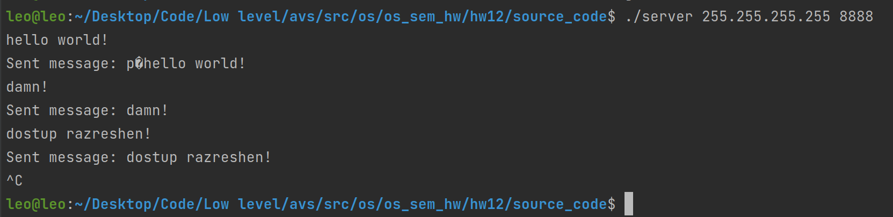
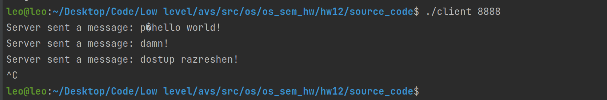

# Семинарское домашнее задание №12

### Взаимодействие UDP клиентов через сервер
#### О задании
* В исходном файле [server.с](source_code/server.c) происходит ввод сообщения с консоли и его широковещательная рассылка клиентам. Адрес и порт задаются аргументами командной строки.
* В исходном файле [client.с](source_code/client.c) происходит прослушивание порта и прием сообщений. Порт указывается в качестве аргумента командной строки

#### Запуск
Для запуска требуется скомпилировать исходные файлы [server.c](source_code/server.c) и [client.c](source_code/client.c) в папке [source_code](source_code) следующими командами:
1) `gcc server.c -o server`
2) `gcc client.c -o client`

Запуск затем можно произвести командой:
1) `./server`
2) `./client`

#### Пример работы

