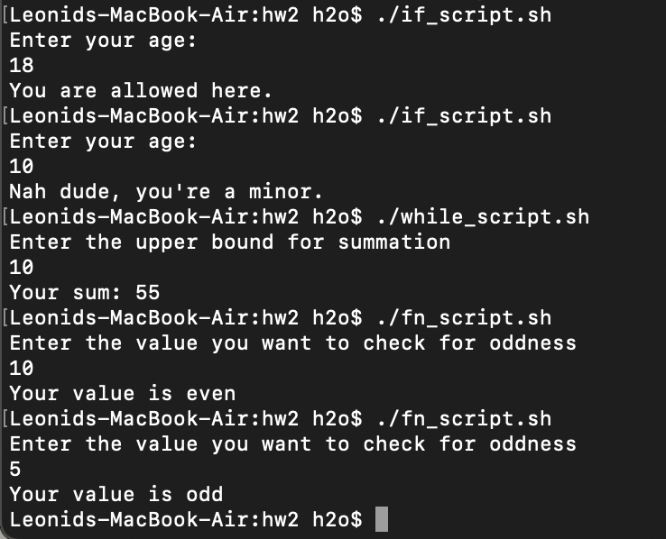

# Семинарское домашнее задание №2

### Баш скрипты
1) [Скрипт, демонстрирующий работу функций в bash](fn_script.sh)
2) [Скрипт, демонстрирующий работу условий в bash](if_script.sh)
3) [Скрипт, демонстрирующий работу цикла while в bash](while_script.sh)

### Пример работы

