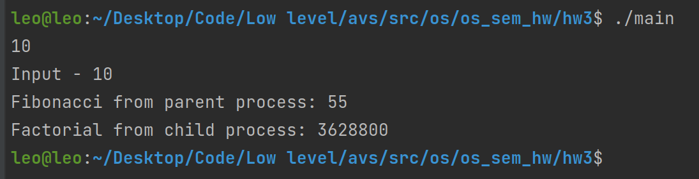

# Семинарское домашнее задание №3

### Родительские и дочерние процессы на языке С/C++
#### О задании
В исходном файле [main.cpp](main.cpp) производится ввод числа N, для которого производится подсчет N-ого числа фибоначи в основном процессе, а также факториала в дочернем процессе.

#### Запуск
Для запуска требуется скомпилировать исходный файл [main.cpp](main.cpp) на языке С++ следующей командой `g++ -std=c++17 main.cpp -o main`.\
После запуска от пользователя ожидается ввод целого числа N и будет произведен расчет.

#### Пример работы

