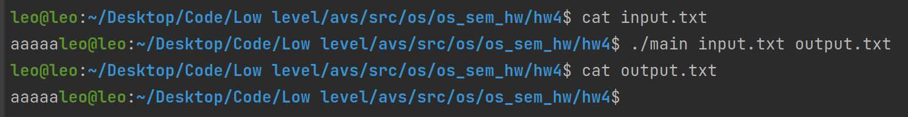

# Семинарское домашнее задание №4

### Буферизованное чтение и запись с помощью системных вызовов read/write на языке C/C++
#### О задании
В исходном файле [main.cpp](main.cpp) происходит буферизованное чтение файла, название которого поступило в качестве первого аргумента командной строки при запуске программы, и последующая запись его содержимого в файл, название которого поступило вторым аргументом командной строки.

#### Запуск
Для запуска требуется скомпилировать исходный файл [main.cpp](main.cpp) на языке С++ следующей командой `g++ -std=c++17 main.cpp -o main`.\
Запуск затем можно произвести командой `./main input.txt output.txt`, где `input.txt` - любое название файла для чтения (он должен существовать), а `output.txt` - любое название файла для записи результата.

#### Пример работы 
