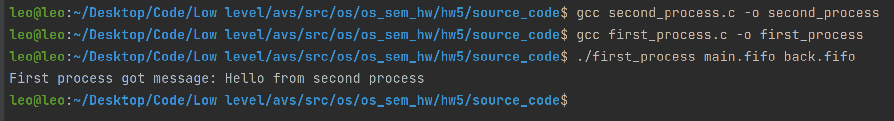

# Семинарское домашнее задание №5

### Передача информации между независимыми процессами с помощью именованных каналов на языке С
#### О задании
* В исходном файле [first_process.c](source_code/first_process.c) происходит создание именованных каналов, переданных в качестве аргументов командной строки и отправка сообщения 'Hello from first process' по первому из переданных каналов, а также прием сообщений по второму из переданных названий каналов.
* В исходном файле [second_process.c](source_code/second_process.c) происходит прием сообщений по первому из переданных каналов, а также отправка сообщения 'Hello from second proccess' по второму из переданных названий каналов.
* В исходном файле [pipe_helper.c](source_code/pipe_helper.c) содержатся вспомогательные функции.

#### Запуск
Для запуска требуется скомпилировать исходные файлы [first_process.c](source_code/first_process.c) и [second_process.c](source_code/second_process.c) в папке [source_code](source_code) следующими командами:
1) `gcc first_process.c -o first_process`
2) `gcc second_process.c -o second_process`

Запуск затем можно произвести командами:
1) `./first_process main.fifo back.fifo`, где `main.fifo` - первый канал связи, а `back.fifo` - второй канал связи
2) `./second_process main.fifo back.fifo`, где `main.fifo` - первый канал связи, а `back.fifo` - второй канал связи

Заметьте, что каналы связи, используемые при запуске обоих процессов должны совпадать. При этом `first_process` должен быть запущен первым, а `second_process` можно запустить из другого терминала.

#### Пример работы 

