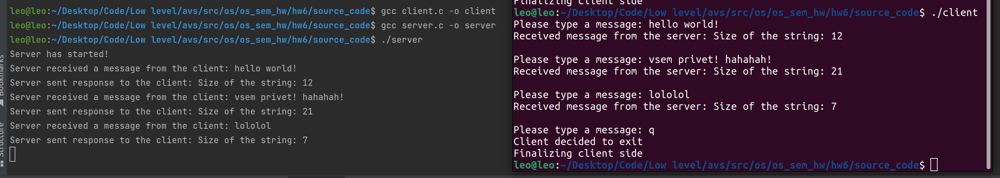

# Семинарское домашнее задание №6

### Передача информации между независимыми процессами с помощью очереди сообщений (System V IPC)
#### О задании
* В исходном файле [client.c](source_code/client.c) происходит считывание отправляемых пользователем сообщений и их отправка серверу, а также прием ответа от сервера. В случае ввода `q` в качестве сообщения происходит завершение клиента и финализация ресурсов.
* В исходном файле [server.c](source_code/server.c) происходит прием сообщений от клиента, их обработка и отправка ответа в формате "Size of the string: %lu".

#### Запуск
Для запуска требуется скомпилировать исходные файлы [client.c](source_code/client.c) и [server.c](source_code/server.c) в папке [source_code](source_code) следующими командами:
1) `gcc client.c -o client`
2) `gcc server.c -o server`

Запуск затем можно произвести командами:
1) `./server`
2) `./client`

Заметьте, что сначала требуется запустить сервер, а уже затем клиент.
Перед запуском убедитесь, что в папке `/tmp` есть файл `cl_sv_com` или создайте его. Содержимое файла неважно.

#### Пример работы
