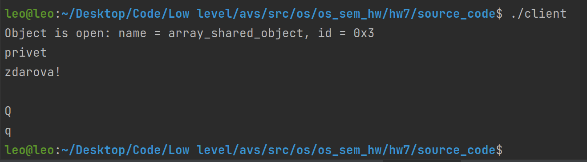
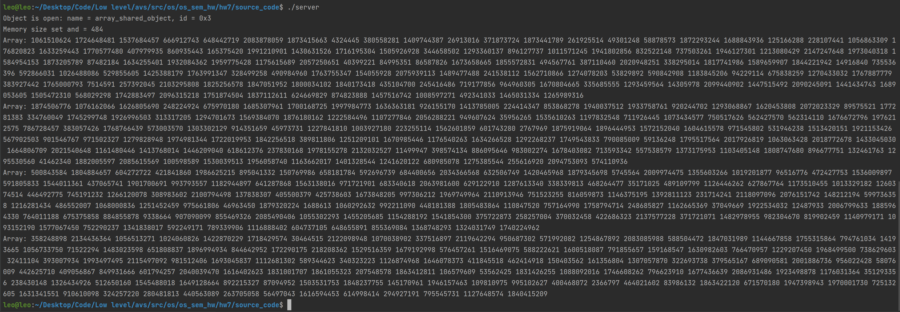

# Семинарское домашнее задание №7

### Взаимодействие процессов через разделяемую память с использованием функций POSIX
#### О задании
* В исходном файле [client.c](source_code/client.c) происходит считывание клиентского сообщения, а затем генерация массива из 120 чисел и последующая его запись в разделяемую память. В случае ввода `q` в качестве сообщения происходит завершение клиента и указание разделяемой памяти о финализации ресурсов.
* В исходном файле [server.c](source_code/server.c) происходит прием массива (чтение разделяемой памяти) от клиента, его распечатка, а затем установка статуса EMPTY в разделяемую память как показатель того, что сообщение было обработано.

#### Запуск
Для запуска требуется скомпилировать исходные файлы [client.c](source_code/client.c) и [server.c](source_code/server.c) в папке [source_code](source_code) следующими командами:
1) `gcc client.c -o client`
2) `gcc server.c -o server`

Запуск затем можно произвести командами:
1) `./client`
2) `./server`

Запуск можно производить в любом порядке. Чтобы сгенерировать массив и отправить его, достаточно ввести какое-то сообщение и нажать ENTER. Для корректного выхода следует написать q на клиенте.

#### Пример работы

