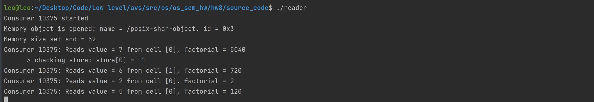

# Семинарское домашнее задание №8

### Синхронизация взаимодействия читателя и писателя
#### О задании
* В исходном файле [reader.c](source_code/reader.c) происходит считывание результата вычисления факториала для сгенерированного значения кольцевым методом.
* В исходном файле [writer.c](source_code/writer.c) происходит считывание сгенерированного значения и вычисление для него факториала, а затем запись в разделяемую память.

#### Запуск
Для запуска требуется скомпилировать исходные файлы [reader.c](source_code/reader.c) и [writer.c](source_code/writer.c) в папке [source_code](source_code) следующими командами:
1) `gcc reader.c common.c -o reader`
2) `gcc writer.c writer.c -o writer`

Запуск затем можно произвести командами:
1) `./reader`
2) `./writer`

Запуск можно производить в любом порядке. Чтобы выйти и завершить оба процесса достаточно нажать CTRL+C в любом из них.

#### Пример работы

