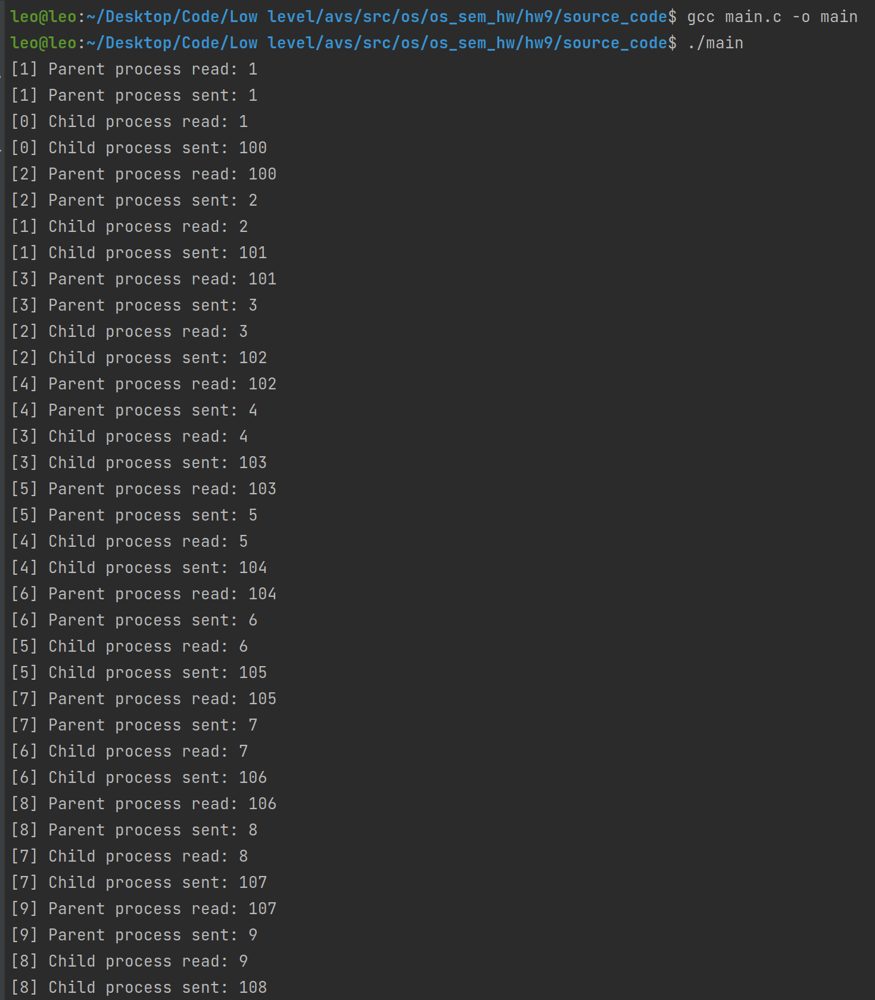
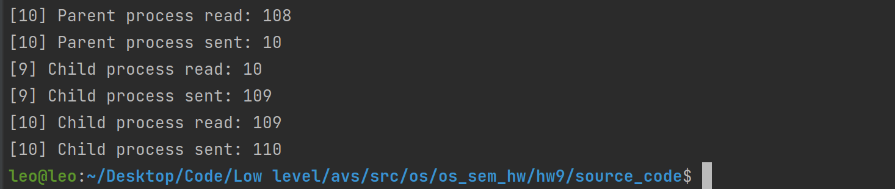

# Семинарское домашнее задание №9

### Синхронизация взаимодействия двух процессов.
#### О задании
* В исходном файле [mainюс](source_code/main.c) происходит взаимодействие дочернего и родительского процесса по следующей схеме: один из процессов получает доступ к семафору, производит чтение из пайпа, затем производит запись. После этого другой процесс процесс производит чтение из пайпа и запись, и так по кругу, пока каждый не отправит и примет 10 сообщений.

#### Запуск
Для запуска требуется скомпилировать исходные файлы [main.c](source_code/main.c) в папке [source_code](source_code) следующей командой:
1) `gcc main.c -o main`

Запуск затем можно произвести командой:
1) `./main`

#### Пример работы

